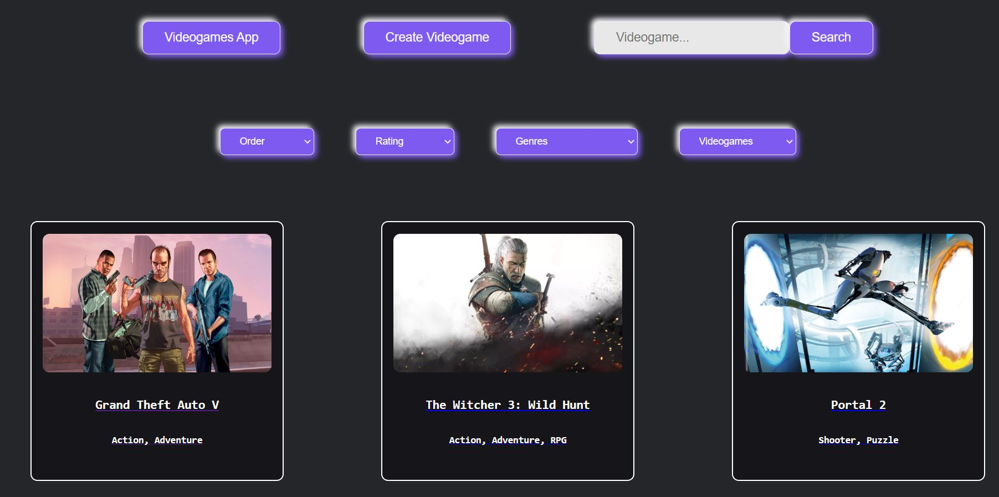

# Videogames

  

## Descripción

Este proyecto es una aplicación de videojuegos, que tiene como objetivo consumir datos de la API externa [Rawg](https://rawg.io/apidocs) para mostrar los juegos en forma de catálogo.

En esta aplicación, el usuario podrá elegir el videojuego de su preferencia buscando en el catálogo a disposición o utilizando filtros, como género, rating y orden alfabético.

## Tecnologías

- [ ] __Frontend__:
  - HTML
  - CSS
  - JavaScript
  - React / Redux
- [ ] __Backend__:
  - NodeJS
  - Express
  - Sequelize
- [ ] __Base de datos__:
  - Postgres
